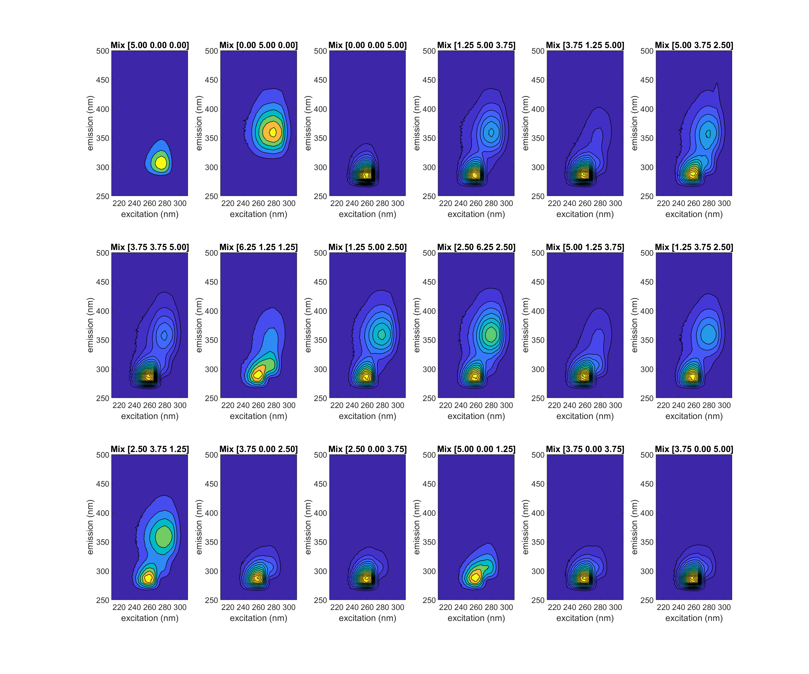
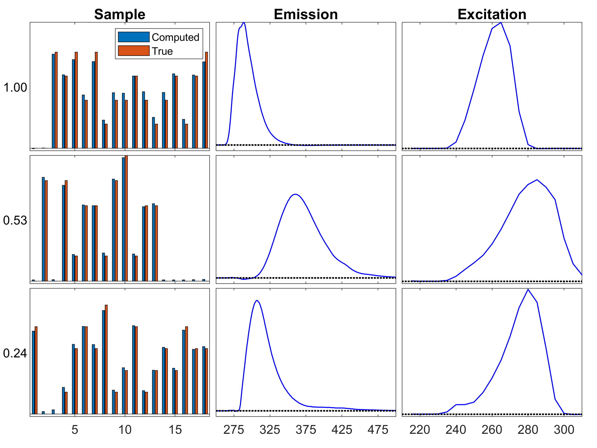
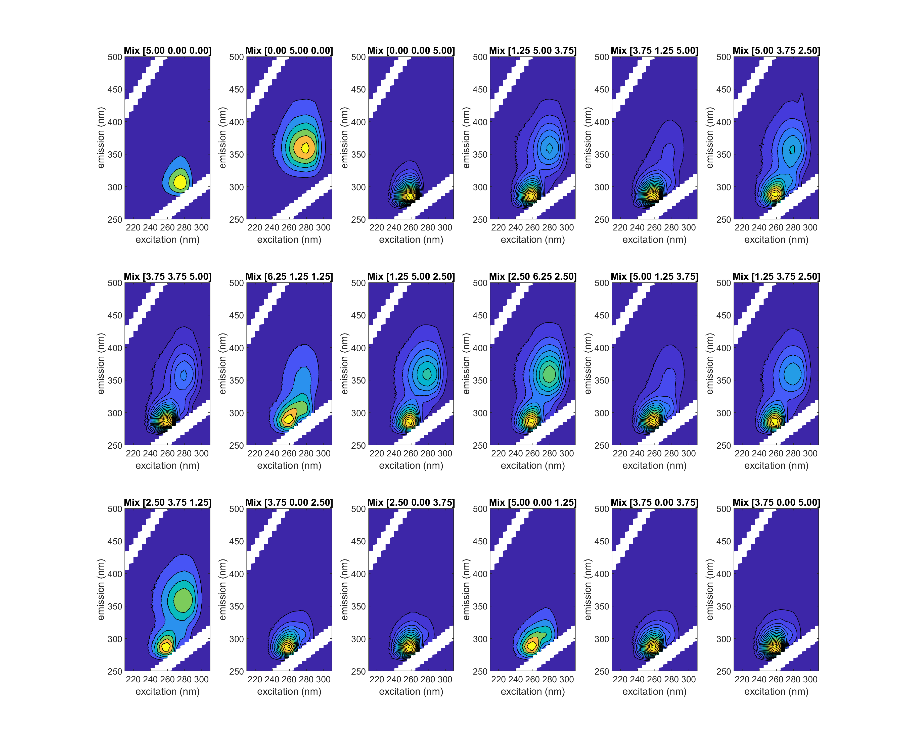

# EEM Dataset

## How to Cite

* T. G. Kolda, EEM Tensor Dataset, https://gitlab.com/tensors/tensor_data_eem, 2021.
* E. Acar, E. E. Papalexakis, G. Gurdeniz,  M. A. Rasmussen,  A. J. Lawaetz, M. Nilsson,  R. Bro, Structure-Revealing Data Fusion, BMC Bioinformatics, 15: 239, 2014.

## Description

The **Excitation Emission Matrix (EEM)** tensor data has been curated from a series of Fluorescence Spectroscopy experiments as reported in Acar et al. (2014). 
The data is EEM measurements on 18 samples, each comprising a mixture of three chemical compounds:

* Valine-Tyrosine-Valine (Val-Tyr-Val) - peptide
* Tryptophan-Glycine (Trp-Gly) - peptide
* Phenylalanine (Phe) - amino acid

The tensor is formatted as
**18 samples x 251 emissions x 21 excitations**.
The data has been preprocessed to fill in missing data and replace negative entries.

## Variables 

Here we describe the variables in the MATLAB data file `EEM18.mat`. 

* `X` - Tensor of size 18 x 251 x 21, nonnegative, preprocessed data. This is the dataset intended to be used for most investigations.
* `Xraw` - Tensor of size 18 x 251 x 21, with 7398 (7.8%) missing entries (indicated by `NaN`) and 4935 (5.2%) negative entries. This is the original data that was preprocessed to obtain `X`.
* `compound_names` - Names of the three chemical compounds present in the samples.
* `mixtures` - 18 x 3 matrix with the relative concentrations of each chemical compound in each sample.
* `mode_titles` - Titles of the three modes, useful for visualization.
* `mode_ranges` - Ranges of the three modes, useful for visualization.

## Details on the Modes

| Mode | Description | Size | Range |
|------|-------------|------|------------------------|
| 1    | Sample        | 18  | 1,2, ..., 18          |
| 2    | Emission      | 251 | 250, 251, ..., 500 nm |
| 3    | Excitation    | 21  | 210, 215, ..., 310 nm |

## Visualization of Tensor X

We visualize the EEM data for each mixture, corresponding to mode-1 slices of `X`. 
This graphic is produced via the command `viz_slices(X,mixtures,1,'X-slices')`.
Each image is titled with the concentrations of the three chemical compounds:

* Valine-Tyrosine-Valine (Val-Tyr-Val) - peptide
* Tryptophan-Glycine (Trp-Gly) - peptide
* Phenylalanine (Phe) - amino acid



## CP computing and visualization

We can compute the rank-3 CP factorization as

```matlab
rng('default')
M = cp_als(X,3);
viz_cp(M,mixtures,[],'eem_model');
```

The visualization of the components is shown below. 
Each rank-1 component is visualized in a row. The number to the left
represents the relative weight of the component.
These components correspond to the three chemical compounds that 
were mixed to make the samples as follows:

* Component 1 - Phe
* Component 2 - Trp-Gly
* Component 3 - Val-Tyr-Val

We also show the true concentrations for comparison in the "sample" mode.




## Refinement

The first three samples each contain only a *single* chemical compound.
These can be omitted to make the problem more interesting, i.e., via

``` matlab
X_new = X(4:15,:,:);
mixtures_new = mixtures(4:15,:,:);
```

## Source & Preprocessing

### Source

We are using _part_ of a larger `EEM_NMR_LCMS.mat` dataset targeted towards demonstrating coupled factorizations
and available at the following website:
http://www.models.life.ku.dk/joda/prototype .

We use the EEM data, stored as `X.data` and corresponding to 28 samples x 251 emissions x 21 excitations.
Missing data is marked as `NaN`.
We have extracted samples: `1,2,3,6,7,9,10,11,12,13,14,15,17,19,20,21,22,27` from `X.data`.

Here are the details of the EEM experiment from http://www.models.life.ku.dk/joda/prototype :

> EEM: Fluorescence Spectroscopy data were acquired on a FS920 spectrophotometer (Edinburgh Instruments, Edinburgh, Scotland). Excitation Emission Matrix data were measured with excitation wavelengths from 210 nm to 310 nm with an increment of 5 nm for each scan, and emission wavelengths from 250 nm to 500 nm with an increment of 1 nm. In order to avoid 1st order Rayleigh scatter, emission data were not acquired in an interval of 10 nm from the excitation wavelength. Excitation and emission monochromator slit widths were set at 5 nm and integration time was 0.1 s/nm. Every sample day a blank sample was measured and subtracted from the samples to eliminate interference from the water Raman signal. Due to the very different quantum yields for the three aromatic amino acids we adjusted the concentrations for the fluorescence experiment. Val-Tyr-Val was diluted 70 times, Trp-Gly was diluted 1000 times, and Phe was doubled in concentration.

### Preprocessing

The preprocessing script is `eem_data_preprocessing.m`.

We select a subset of the 28 samples for inclusion in our dataset:
``` matlab
load('EEM_NMR_LCMS.mat');
ii = [1,2,3,6,7,9,10,11,12,13,14,15,17,19,20,21,22,27];
Xraw = tensor(X.data(ii,:,:));
```

The original raw data is shown below. The white indicates missing data.
This graphic is produced via the command `viz_slices(Xraw,mixtures,1,'Xraw-slices')`.


In order to fill in the missing data in Xraw, we run 10 trials of `cp_wopt` 
and select the model produced by the best one.

```matlab
rng('default');
ntrials = 10;
results = cell(ntrials,1);
W = tensor(~isnan(Xraw.data));
for t = 1:ntrials
    [M,~,info] = cp_wopt(Xraw,W,3,'lower',0);    
    results{t}.M = M;    
    results{t}.score = s;
end
[fmin,tmin] = max(cellfun(@(x) x.feval, results));
M = results{tmin}.M;
```

We then fill in the missing data *and* the nonnegative data with the values produced by `M`:

```matlab
Mdata = double(full(M));
Xdata = Xraw.data;
fillidx = isnan(Xdata) | (Xdata<0);
Xdata(fillidx) = Mdata(fillidx);
X = tensor(Xdata);
```
